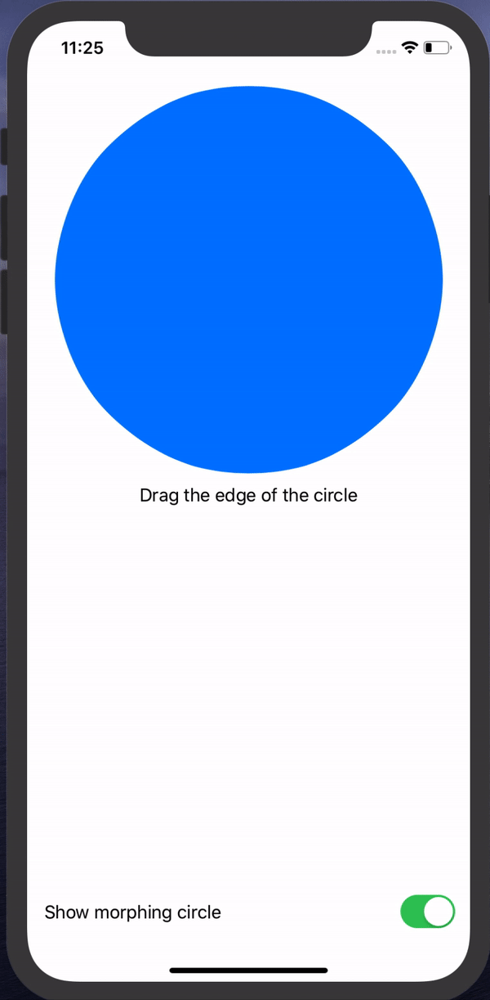

# SwiftUI+PathAnimations 🔵

## Introduction

This packages contains `SimilarShape` and `InterpolatedShape`, both can be used to achieve shapes animations with SwiftUI.

## How it works?

`SimilarShape` should be used when animating two or more similar paths. A path is similar to another one when having the same number and types of `Path.Element`. I.e.: two rects with different height, width and origin are considered similar, since the two paths are made by the same `Path.Element` but with different `CGPoint`.

`InterpolatedShape` should be used when animating two or more different paths. Internally, it will create a slighlty different path used for animation, by interpolating the original one. 

## Example

The attached example (Example/Example.xcodeproj) is using:
* `SimilarShape` to perform the drag animation of the morphing circle 🔵, since the `Path` create starting from the original circle and the one create with the dragging point are essentially the same
* `InterpolatedShape` to perform the animated trasformation from a circle and a rounded rectangle, being very different paths.

## Author

Feel free to reach me out at [@adellibovi](https://twitter.com/adellibovi)

## License

This project is licensed under the MIT License - see the [LICENSE](LICENSE) file for details
